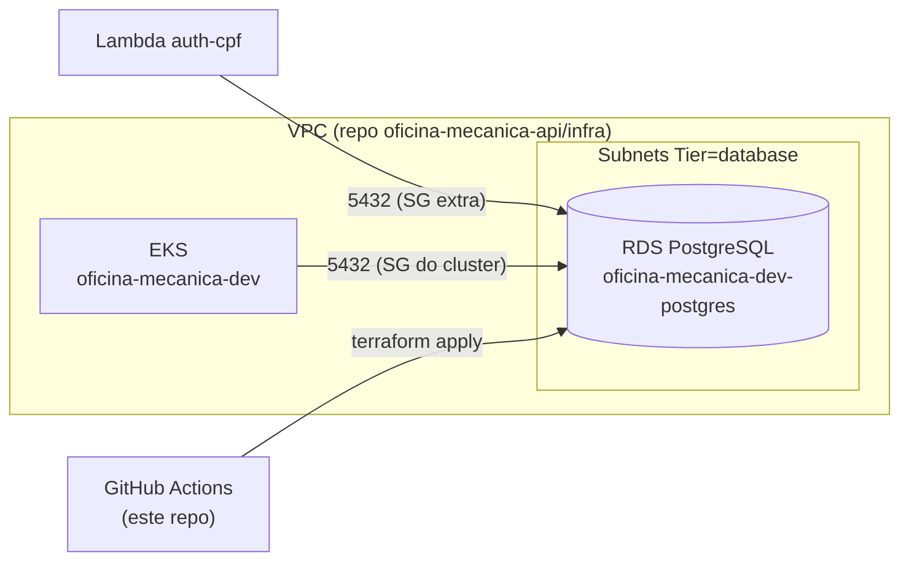

# oficina-mecanica-infra-db

Infraestrutura como código (Terraform) do **banco de dados gerenciado** do sistema
Oficina Mecânica (FIAP SOAT — Tech Challenge Fase 3): RDS PostgreSQL privado na AWS,
acessível apenas pelo cluster EKS (e SGs extras autorizados, como a Lambda de autenticação).

## Tecnologias

- Terraform >= 1.6.0 (AWS provider ~> 5.0)
- AWS RDS PostgreSQL (privado, criptografado, backup 7 dias, autoscaling de storage 20→100 GiB)
- GitHub Actions (validação em PR, `terraform apply` automático na `main`)
- Backend remoto S3 (+ lock opcional em DynamoDB)

## Arquitetura



Este repo **não cria** VPC nem EKS: descobre-os via data sources (cluster por nome
`oficina-mecanica-dev`, subnets pela tag `Tier=database`). Por isso o stack de
rede/EKS precisa estar aplicado antes.

## Ordem de provisionamento

1. `oficina-mecanica-api/infra` (ou repo de K8s) — VPC, subnets, EKS
2. **este repo** — RDS
3. `oficina-mecanica-api` — deploy da aplicação (consome `postgres_address` via variável `RDS_HOST`)
4. `oficina-mecanica-lambda-auth` — Lambda (consome `postgres_host`)

## Como executar localmente

```bash
cp .env.example .env             # edite a senha
source .env
cp backend.tf.example backend.tf # edite bucket/key, ou rode sem backend p/ testar
terraform init
terraform plan
terraform apply
```

AWS Academy: exporte também `AWS_SESSION_TOKEN` e use `db_storage_type = "gp2"`.

## CI/CD

| Evento | Comportamento |
| --- | --- |
| Pull request | `terraform fmt` + `validate` |
| Push na `main` | `plan` + **`apply` automático** (state S3 `oficina-mecanica/db/terraform.tfstate`) |
| `workflow_dispatch` | `plan` ou `destroy` manuais |

Secrets: `AWS_ACCESS_KEY_ID`, `AWS_SECRET_ACCESS_KEY`, `AWS_SESSION_TOKEN` (Academy), `DB_PASSWORD`.
Variables: `AWS_REGION`, `TF_STATE_BUCKET`, `TF_STATE_KEY` (opcional), `TF_STATE_DYNAMODB_TABLE` (opcional), `DB_NAME`, `DB_USERNAME`.

## Repositórios relacionados

- [oficina-mecanica-api](https://github.com/32SOAT/oficina-mecanica-api) — aplicação principal (NestJS em EKS)
- [oficina-mecanica-infra-k8s](https://github.com/32SOAT/oficina-mecanica-infra-k8s) — infraestrutura Kubernetes
- [oficina-mecanica-lambda-auth](https://github.com/32SOAT/oficina-mecanica-lambda-auth) — autenticação serverless via CPF
